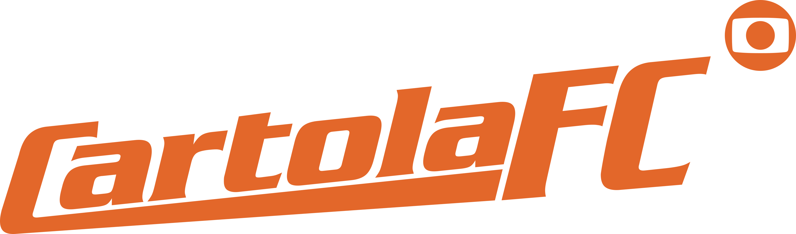

# Um cliente de API simples em PHP para CartolaFC

<!-- [](https://travis-ci.com/codenix-sv/coingecko-api)
[](https://scrutinizer-ci.com/g/codenix-sv/coingecko-api/?branch=master)
[](https://codeclimate.com/github/codenix-sv/coingecko-api/test_coverage)
[](https://codeclimate.com/github/codenix-sv/coingecko-api/maintainability)
[](https://github.com/codenix-sv/coingecko-api/blob/master/LICENSE) -->



Um cliente de API simples, escrito com PHP para [CartolaFC](https://ge.globo.com/cartola-fc/).

Cartola FC é um jogo do site da Globo criado em 2005. O game é do estilo "Footbaal Manager" e "Fantasy", nele você comanda seu próprio clube, escala os jogadores e técnicos com base no que acontece na vida real dentro de campo. Por meio de pontuações que levam o nome de 'scouts', o jogador escolhe aqueles jogadores que apresentam bom rendimento e pontos na partida, que são transferidos para o Cartola. 

O jogo do Cartola acontece durante todo o Campeonato Brasileiro, gerando pontuações para os jogadores, que podem criar e participar de ligas com os amigos. Nas graças do povo, o jogo é muito popular entre os fanáticos pelo futebol.

## Requisitos

* PHP >= 7.4
* ext-json

## Instalação

A maneira preferida de instalar este pacote é por meio do [composer](http://getcomposer.org/download/).

Rode

```bash
$ composer require humble23/cartola-fc-api
```
Ou Adicione

```json
"humble23/cartola-fc-api": "^1.1"
```
## Uso básico

### Exemplo
```php
use Humble23\CartolaFcClient\CartolaClient;

$client = new CartolaClient();
$response = $client->market()->status();
```

Para obter a última resposta (`ResponseInterface::class`) use o método `getLastResponse`:
```php
use Humble23\CartolaFcClient\CartolaClient;

$client = new CartolaClient();
$data = $client->market()->isGameOver();
$response = $client->getLastResponse();
```

## Métodos disponíveis

### Market

#### Status

Checa as informações atual do mercado

```php
$data = $client->market()->status();
```

#### Highlights

Lista os destaques do mercado

```php
$data = $client->market()->highlights();
```

### Game

#### Rounds

Lista as rodadas da temporada

```php
$data = $client->game()->rounds();
```

#### Clubs

Lista todos clubes da temporada

```php
$data = $client->game()->clubs();
```

#### Sponsors

Lista todos os patrocinadores

```php
$data = $client->game()->sponsors();
```

#### IsGameOver

Verifica se a temporada terminou

```php
$data = $client->game()->isGameOver();
```

#### CurrentRound

Verifica qual a atual rodada da temporada

```php
$data = $client->game()->currentRound();
```

### Leagues

#### All

Lista todas as ligas da temporada

```php
$data = $client->leagues()->all();
```

### Teams

#### All

Lista todos os times do cartola

```php
$data = $client->teams()->all();
```

#### Find

Pesquisa por um time apartir do seu nome

```php
$data = $client->teams()->find('team_name');
```

#### Athletes

Lista os atletas de um time por rodada

```php
$data = $client->teams()->athletes('team_id', 'round_number');
```

### Athletes

#### Market

Lista os atletas no mercado

```php
$data = $client->athletes()->market();
```

#### Score

Lista os atletas pontuados da rodada atual

```php
$data = $client->athletes()->score();
```

## Licença

`humble23/cartola-fc-api` é lançado sob a licença do MIT. Veja o pacote [LICENSE](./LICENSE) para detalhes.
